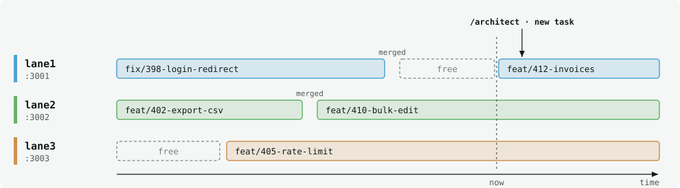
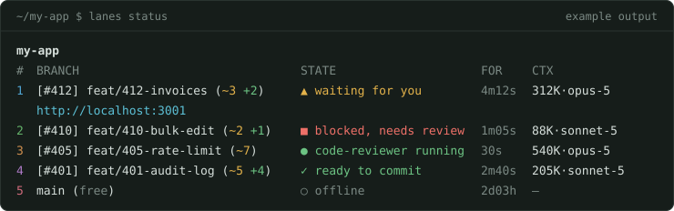

# agent-system

Claude Code writes code fast. agent-system adds the two brakes it doesn't ship
with — **think before typing** and **review before committing** — plus a
zero-token dashboard that shows which worktree session is waiting on you.

Zero dependencies. Plain Node ESM and two shell scripts.


The amber diamonds are where you decide; nothing moves to the next phase on its
own. A pipeline that runs straight through multiplies the cost of a bad first
step by every stage after it, and turns you into the final approver of a large
diff instead of a pilot correcting course. The red line is the commit guard: if
the diff changes after review, the commit is blocked.

## What changes day to day

| Claude Code alone | With agent-system |
|---|---|
| It misreads the request, and you find out in an 800-line diff. | `/architect` interrogates the problem with you, and a second agent with none of your context attacks the spec before any code exists. |
| Review applies generic best practices. | The reviewer applies your project's own criteria: its `domainAxes`, its `CLAUDE.md`, its recorded decisions. |
| A review hands you a list and you rule on every item. | Mechanical fixes apply themselves; only judgment calls reach you. |
| On a busy day, an unreviewed commit slips through. | `git commit` is blocked until that exact diff has passed `/gate`, and the approval expires if you touch a line. |
| With four sessions open, you lose track of which one is waiting. | `lanes status` shows it live and notifies you, without spending a token. |
| The next session "fixes" something that was deliberate. | `DECISIONS.md` keeps the why and what was rejected, and the reviewer flags any diff that contradicts it. |

**By design:** opt-in per repo — no `.claude/agent-system.json` at its root
means no events, no commit guard, no warnings. The reviewer and test-writer
read each project's own config instead of hardcoding one team's conventions.
And `git pull` plus re-running `./install.sh` is the whole upgrade.

## Install

```bash
./install.sh                                  # once per machine
export PATH="$PWD/bin:$PATH"                  # add to ~/.zshrc to keep it
cd <your repo>
lanes adopt                                   # once per repo — detects what it can
$EDITOR .claude/agent-system.json
lanes doctor                                  # verify
```

Then fill in `review.domainAxes`: it is the field that decides whether the
reviewer is worth running. Full walkthrough (prerequisites, config fields,
troubleshooting): [`docs/SETUP.md`](docs/SETUP.md).

## How it works

### `/architect` — think before typing

Before a line of code exists, `/architect` interrogates the request: what
breaks today and for whom, the cheapest thing that would fix it, what else it
touches, and how you will know it worked. The answers become a spec with an
explicit contract — module paths, signatures, error cases. Then
`spec-challenger`, an agent that never heard the conversation, tries to tear
it apart. Objections that hold get folded in; the rest are argued in front of
you. Only when you confirm does it create the GitHub issue and its branch, in a
free lane. An example of what lands in the issue, with the default sections:

```text
#412  Export invoices as CSV
Problem        Finance rebuilds the monthly invoice export by hand: ~2 h, error-prone.
Constraints    No new dependencies; the invoices API must not change.
Approach       Stream rows server-side. Rejected: client-side export — the
               largest accounts time out in the browser.
Contract       GET /invoices/export?month=YYYY-MM → 200 text/csv
               400 { "error": "invalid_month" } on a malformed month
Out of scope   Excel output, scheduled exports.
Acceptance     A 50k-row month downloads in under 10 s; totals match the ledger.
Suggested implementation model: Sonnet — the contract leaves nothing to decide.
```

It never writes code in the repo, on purpose: the moment an implementation is
on screen you stop questioning the problem and start reviewing code. Use it
for non-trivial work; skip it for a typo.

### `/gate` — review against your project's own criteria


One command before every commit. The reviewer starts with clean context and
only reports. Mechanical findings are applied without asking; judgment calls
come to you as questions. The gates run last, on the tree as modified, and a
failure is reported as a warning — your call, not a block.

What makes the reviewer worth running is `review.domainAxes`: your team's rules
that a linter cannot know. Leave it empty and it only finds what your linter
already finds. A real axis from this repo:

> English only for everything committed — prompts, issues, specs, code
> comments, commit messages. Flag any other language slipping into a diff.

### Commit guard — an approval that expires with the code

`/gate` leaves a mark holding the diff's fingerprint: a hash of every changed
path and its content. The guard, a hook on `git commit`, compares that mark
with the diff as it is now:

| | Mark | Diff now | `git commit` |
|---|---|---|---|
| Right after `/gate` | `a41f9c2` | `a41f9c2` | ✓ passes |
| You touch one line | `a41f9c2` | `7d03be8` | ■ blocked |
| You only `git add` | `a41f9c2` | `a41f9c2` | ✓ still valid |

It blocks rather than warns, and offers a choice: run `/gate`, or commit
unreviewed this one time. A warning gets ignored on busy days; a block with no
way out gets switched off. It guards the `git commit` commands Claude runs
directly — not one wrapped in `bash -c` or a subshell — and from your own
terminal you commit as usual.

### `lanes` — parallel work without losing the thread

A lane is a long-lived git worktree: its own directory, branch and port, all on
the same repo. You create lanes once and cycle branches through them. A lane is
free when its tree is clean and it has no commits missing from `origin/<base>`,
and `/architect` places each new task in a free one. A merge-commit merge frees
the lane after the next fetch; a squash or rebase merge never does, since it
rewrites the commits — reclaim that lane with `lanes reset <n> --force`.



Each session's hooks append events to a local log that `lanes status` reads
every second — nothing calls the model, so the dashboard costs zero tokens.



`~3` is uncommitted changes, `+2` commits ahead of the base branch. Desktop
notifications ("Waiting for you") are macOS-only.

```
lanes new              Create the next lane, detached at origin/main
lanes switch <n> <br>  Put a branch in a lane (--create to make it)
lanes rm               Remove the top lane; refuses to lose work
lanes dev <n>          Start a lane's services
lanes status           Live dashboard — leave it running in a terminal
lanes status --once    One-shot snapshot: branch, marks, state, context, running services
```

Full command reference (numbering, per-machine overrides, services, colours):
[`docs/SETUP.md`](docs/SETUP.md#5-managing-lanes).

### `DECISIONS.md` — the memory of why

Any decision a future session might plausibly undo, because it looks odd, goes
into `DECISIONS.md` with what was rejected and why. `/architect` and `/gate`
propose entries, you approve or skip them, and the reviewer reads the log on
every run: it stops reporting deliberate choices as problems, and flags any
diff that contradicts a live entry. The file itself is the opt-in; set
`review.decisionsFile` if yours is not at the repo root. A real entry:

```text
## D12 — Opt-in is `.claude/agent-system.json`; absence means total silence
`product` · 2026-08 · `lib/context.mjs:findProject`
No config at a repo root → no events, no commit guard, no warnings. Rejected:
opt-out or auto-detection — every repo you never thought about would start
blocking commits.
```

## What it costs

- **Claude Code only, and GitHub only for issues.** With another assistant, or
  with Jira or Linear, you lose much of the flow.
- **Time and tokens on every commit.** `/gate` runs `code-reviewer` on Opus
  and `test-writer` on Sonnet; `/architect`'s `spec-challenger` is Opus too.
- **It depends on committing small.** The design assumes findings get applied
  at ~200 changed lines and ignored at 800 — hence the large-diff warning.
- **Adopting it is a commit.** `.claude/agent-system.json` lives in the repo.
- **The dashboard reads undocumented Claude Code state.** If an update changes
  it, the dashboard loses accuracy; everything else keeps working.

Operational limitations, once you use it:
[`docs/REFERENCE.md`](docs/REFERENCE.md#known-limitations).

## Learn more

| | |
|---|---|
| Install + per-repo config | [`docs/SETUP.md`](docs/SETUP.md) |
| Full `lanes` command reference | [`docs/SETUP.md`](docs/SETUP.md#5-managing-lanes) |
| Commit guard, events, known limitations, tests | [`docs/REFERENCE.md`](docs/REFERENCE.md) |
| Why the code is the way it is | [`DECISIONS.md`](DECISIONS.md) |

## Layout

```
CLAUDE.md          repo rules; points every session at DECISIONS.md
DECISIONS.md       why the code is the way it is, and what was rejected
docs/SETUP.md      install + per-repo configuration walkthrough
docs/REFERENCE.md  commit guard, events, known limitations, tests
docs/img/          the diagrams in this README
agents/            spec-challenger, code-reviewer, test-writer  → ~/.claude/agents/
skills/            architect, gate                              → ~/.claude/skills/
hooks/             emit.mjs, commit-guard.{sh,mjs}              → wired in settings.json
lib/               context.mjs (project/lane/event), marks.mjs (review markers)
ui/                dashboard.mjs (the lane dashboard)
bin/               lanes (sh wrapper) + lanes.mjs — put this dir on your PATH
config/            schema + annotated example
test/              smoke.mjs — npm test
```
